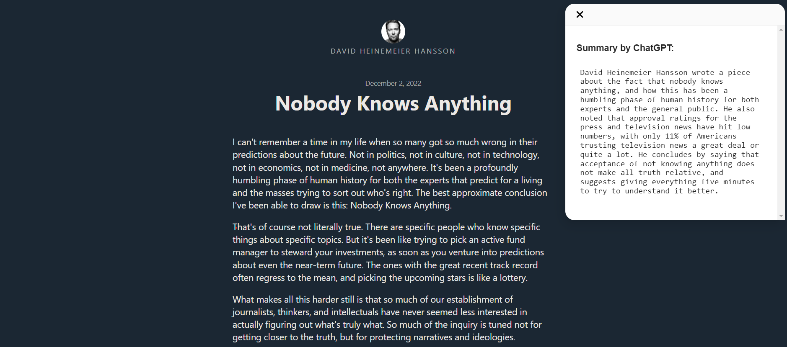

# Summarize

Browser Extension to summarize web page content using ChatGPT, support Chrome (more on the way!)

## Installation

### Install to Chrome/Edge

#### Install from Chrome Web Store

https://chrome.google.com/webstore/detail/summarize/lmhkmibdclhibdooglianggbnhcbcjeh

#### Local Install

1. Download `chrome.zip` from [Releases](https://github.com/clmnin/summarize.site/releases)
2. Unzip the file
3. In Chrome/Edge go to the extensions page (`chrome://extensions` or `edge://extensions`).
4. Enable Developer Mode.
5. Drag the unzipped folder anywhere on the page to import it (do not delete the folder afterwards).

## Build from source

1. Clone the repo
2. Install dependencies with `yarn`
3. Run `yarn dev`
4. Load the `build` directory to your browser

## Credit

This project is inspired by [wong2/chat-gpt-google-extension](https://github.com/wong2/chat-gpt-google-extension)